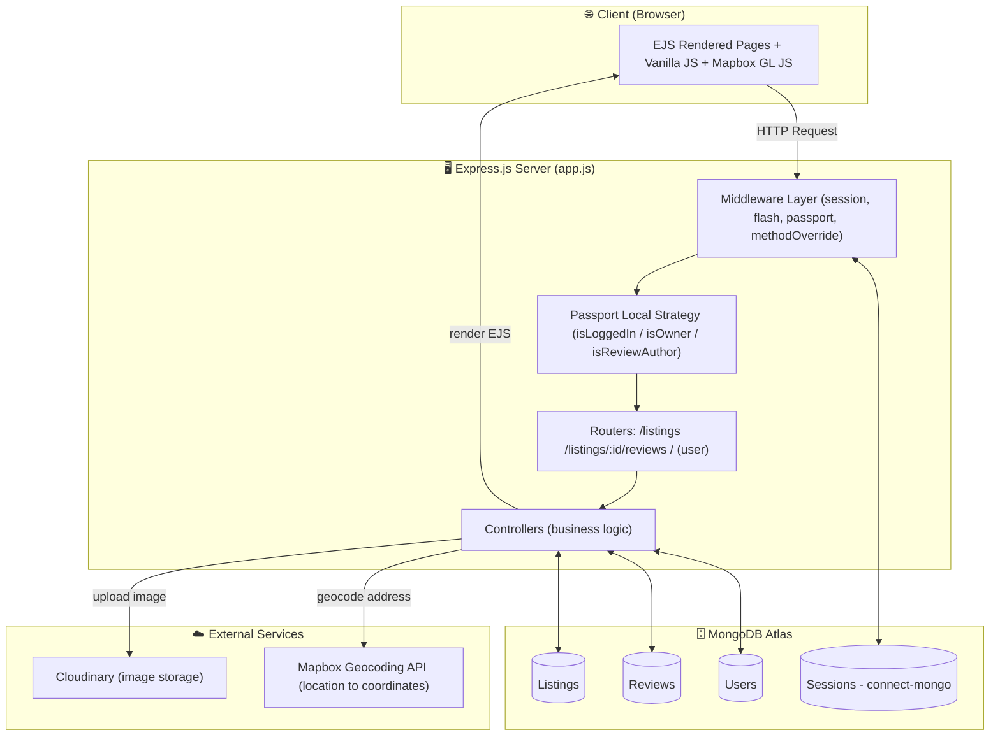
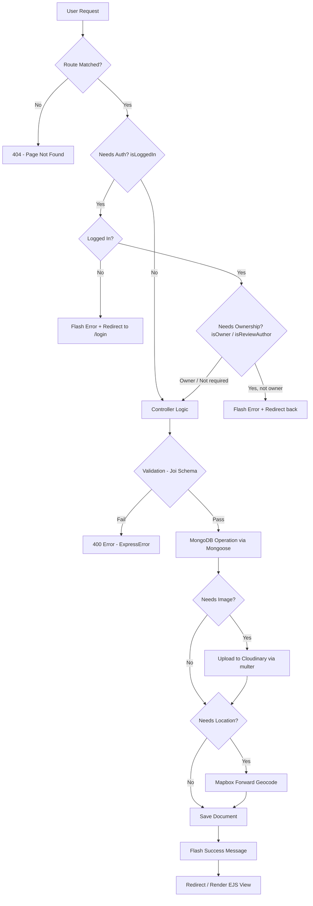
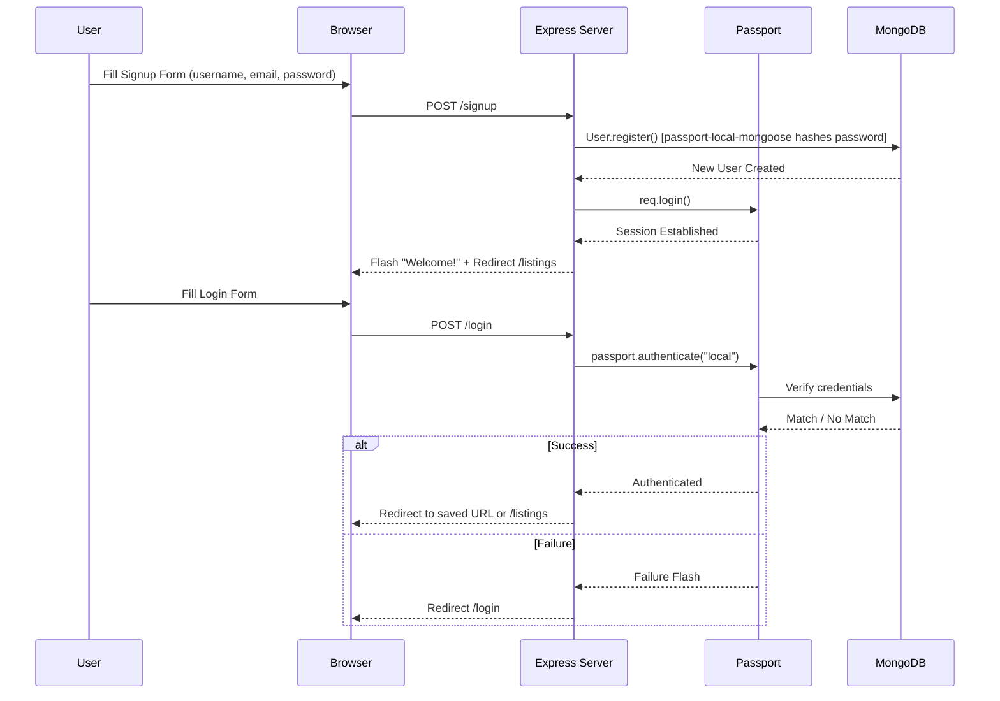

# 🌍 Wanderlust — Accommodation Listing Web Application

Wanderlust is a full-stack **accommodation listing web application** where users can list their own properties, browse listings created by others, add reviews and ratings, and view the exact property location on an interactive map. The project is built on **Node.js, Express, and MongoDB (Mongoose)**, and uses **EJS templating**, **Passport authentication**, **Cloudinary image storage**, and **Mapbox geocoding**.

> Note: This is a **listing/CRUD application** — it does not include an actual booking/reservation or payment system. Users can create, view, edit, delete, and review listings only.

---

## 🚀 Live Demo

🔗 **Live URL:** https://wanderlust-app-yni0.onrender.com

> Note: Hosted on Render's free tier, so the first request may take 30-50 seconds to "wake up" the server.

---

## 📸 Application Screenshots

<table>
<tr>
<td width="50%"><b>Landing Page (Home)</b><br></td>
<td width="50%"><b>Page After Login</b><br></td>
</tr>
<tr>
<td width="50%"><b>Host - List a New Listing</b><br></td>
<td width="50%"><b>Visit Page - See Details</b><br></td>
</tr>
<tr>
<td width="50%"><b>Host Only - Update / Delete</b><br></td>
<td width="50%"><b>Add a Review</b><br></td>
</tr>
<tr>
<td width="50%"><b>Page - See Given Reviews</b><br></td>
<td width="50%"></td>
</tr>
</table>

---

## 🗄️ Database Schema (Models)

<table>
<tr>
<td width="50%"><b>Listing Model</b><br></td>
<td width="50%"><b>Review Model</b><br></td>
</tr>
<tr>
<td width="50%"><b>User Model</b><br></td>
<td width="50%"></td>
</tr>
</table>

---

## 🛠️ Tech Stack

**Backend**
- Node.js (v22.14.0)
- Express.js v5
- MongoDB + Mongoose ODM
- express-session + connect-mongo (session store in DB)
- Passport.js + passport-local + passport-local-mongoose (authentication)
- connect-flash (flash messages)
- method-override (PUT/DELETE via forms)
- Joi (server-side validation)

**Frontend / View Engine**
- EJS + ejs-mate (layouts/partials)
- Vanilla CSS
- Mapbox GL JS (map + marker on listing page)

**Third-Party Services**
- **Cloudinary** — image upload & storage (via `multer` + `multer-storage-cloudinary`)
- **Mapbox** — forward geocoding (location string → lat/lng) + interactive map

**Dev Tools**
- nodemon (dev auto-reload)
- dotenv (environment variables)

### 📦 Key Packages (`package.json`)

| Package | Purpose |
|---|---|
| `express` | Web server / routing framework |
| `mongoose` | MongoDB ODM (schema modeling) |
| `mongodb` | Mongo driver |
| `ejs-mate` | Layout support for EJS |
| `passport`, `passport-local`, `passport-local-mongoose` | Authentication |
| `express-session`, `connect-mongo` | Session management (stored in Mongo) |
| `connect-flash` | One-time flash (success/error) messages |
| `joi` | Request body validation |
| `method-override` | Support PUT/DELETE from HTML forms |
| `cloudinary`, `multer`, `multer-storage-cloudinary` | Image upload pipeline |
| `@mapbox/mapbox-sdk` | Server-side geocoding |
| `dotenv` | Load `.env` config |
| `nodemon` | Dev-time auto-restart |

---

## 📂 Folder Structure

```
wanderlust-app-main/
├── app.js                     # App entry point (DB connect, middleware, routes mount)
├── cloudConfig.js             # Cloudinary + multer storage config
├── schema.js                  # Joi validation schemas (listing/review)
├── middleware.js              # isLoggedIn, isOwner, isReviewAuthor, validators
│
├── controllers/                # Route handler logic
│   ├── listings.js
│   ├── reviews.js
│   └── user.js
│
├── routes/                     # Express routers
│   ├── listing.js
│   ├── review.js
│   └── user.js
│
├── models/                     # Mongoose schemas
│   ├── listing.js
│   ├── review.js
│   └── user.js
│
├── init/                        # DB seeding
│   ├── data.js                 # sample listing data
│   └── index.js                 # seed script
│
├── utils/
│   ├── ExpressError.js         # custom error class
│   └── wrapAsync.js            # async error wrapper
│
├── views/                       # EJS templates
│   ├── layouts/boilerplate.ejs
│   ├── includes/ (navbar, footer, flash)
│   ├── listings/ (index, show, new, edit, error)
│   └── user/ (login, signup)
│
└── public/
    ├── css/                     # style.css, rating.css
    └── js/                      # map.js, boilerplate.js
```

---

## 🏗️ System Design / Architecture



---

## 🔄 Application Flow Chart (Request Lifecycle)



---

## 🔐 Authentication Flow



---

## 🛣️ Routes / API Endpoints

### 🏘️ Listings (`/listings`)

| Method | Route | Middleware | Controller | Description |
|---|---|---|---|---|
| GET | `/listings` | – | `index` | Show all listings |
| GET | `/listings/new` | `isLoggedIn` | `renderNewForm` | Form to create a new listing |
| POST | `/listings` | `isLoggedIn`, `validateListing`, `upload` | `createListing` | Create a new listing (with image upload + geocoding) |
| GET | `/listings/:id` | – | `showListing` | View full details of a listing + its reviews + map |
| GET | `/listings/:id/edit` | `isLoggedIn`, `isOwner` | `renderEditForm` | Form to edit a listing |
| PUT | `/listings/:id` | `isLoggedIn`, `isOwner`, `upload`, `validateListing` | `updateListing` | Update a listing |
| DELETE | `/listings/:id` | `isLoggedIn`, `isOwner` | `destroyListing` | Delete a listing (cascades: its reviews are deleted too) |

### ⭐ Reviews (`/listings/:id/reviews`)

| Method | Route | Middleware | Controller | Description |
|---|---|---|---|---|
| POST | `/listings/:id/reviews` | `isLoggedIn`, `validateReview` | `createReview` | Add a review + rating to a listing |
| DELETE | `/listings/:id/reviews/:reviewId` | `isLoggedIn`, `isReviewAuthor` | `destroyReview` | Delete a review (author only) |

### 👤 User / Auth (`/`)

| Method | Route | Middleware | Controller | Description |
|---|---|---|---|---|
| GET | `/signup` | – | `renderSignupForm` | Show signup form |
| POST | `/signup` | – | `signup` | Register a new user (auto-login on success) |
| GET | `/login` | – | `renderLoginForm` | Show login form |
| POST | `/login` | `saveRedirectUrl`, `passport.authenticate` | `login` | Log the user in |
| GET | `/logout` | – | `logout` | Log the user out |

### ⚠️ Fallback

| Method | Route | Description |
|---|---|---|
| ANY | `*` (unmatched) | 404 → `views/listings/error.ejs` |
| – | Global error handler | All thrown `ExpressError` instances are caught here |

---

## 🗃️ Database Models (Mongoose Schemas)

**Listing**
- `title`, `description`, `price`, `location`, `country` — required strings/number
- `image: { url, filename }` — Cloudinary reference
- `geometry: { type: "Point", coordinates: [lng, lat] }` — GeoJSON for the map
- `owner` → ref `User`
- `reviews` → array of ref `Review`
- Post-delete hook: when a listing is deleted, all of its associated reviews are cascade-deleted

**Review**
- `comment` (String, required)
- `rating` (Number, 1–5, required)
- `createdAt` (Date, default now)
- `author` → ref `User`

**User**
- `email` (String, required, unique)
- Plugin: `passport-local-mongoose` — automatically adds `username`, hashed `password`, salt, and auth methods (`register`, `authenticate`, `serializeUser`, `deserializeUser`)

---

## ⚙️ Setup / Getting Started (Local)

1. **Clone the repo**
   ```bash
   git clone <repo-url>
   cd wanderlust-app-main
   ```

2. **Install dependencies**
   ```bash
   npm install
   ```

3. **Create a `.env` file** in the root with:
   ```env
   MONGO_URL=your_mongodb_connection_string
   SECRET=your_session_secret
   CLOUD_NAME=your_cloudinary_cloud_name
   CLOUD_API_KEY=your_cloudinary_api_key
   CLOUD_API_SECRET=your_cloudinary_api_secret
   MAP_TOKEN=your_mapbox_access_token
   PORT=8080
   ```

4. **(Optional) Seed sample data**
   ```bash
   npm run seed
   ```

5. **Run in development mode**
   ```bash
   npm run dev
   ```
   The app will start at `http://localhost:8080`

6. **Run in production mode**
   ```bash
   npm start
   ```

---

## ✨ Core Features

- 🔑 Full authentication (signup/login/logout) with hashed passwords via Passport
- 🏠 CRUD operations on listings (create, read, update, delete)
- 🖼️ Image upload directly to Cloudinary
- 🗺️ Auto-geocoding of an address → interactive Mapbox map on the listing page
- ⭐ Star-rating reviews on each listing
- 🔒 Owner-only edit/delete protection & review-author-only delete protection
- 💬 Flash messages for success/error feedback
- 🍪 Persistent login sessions stored in MongoDB (7-day cookie expiry)
- 🛡️ Server-side validation using Joi + custom error handling middleware
- 🚫 No booking/payment/reservation system — this is a listing showcase app only

---

## 📄 License

ISC

## Auther 

Raghuveer Kumawat